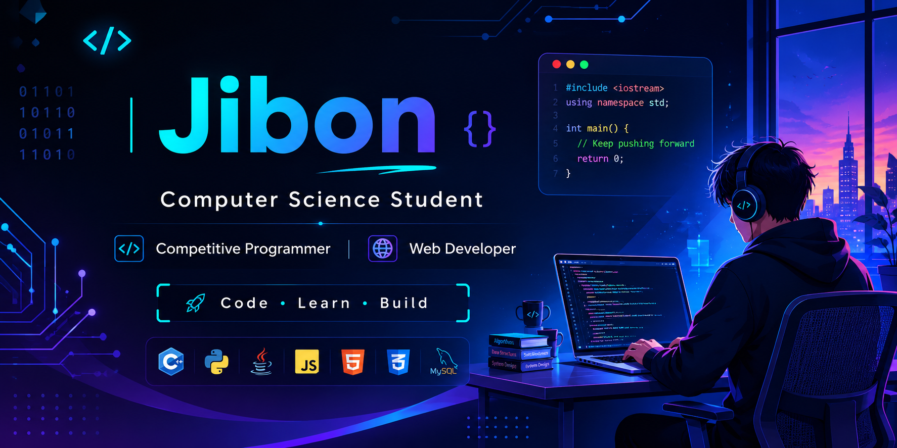

  

## 🚀 About Me

- 🎓 Computer Science Student
- 💻 Passionate about Competitive Programming
- 🌐 Interested in Full Stack Web Development
- 🔐 Learning Cyber Security
- 🧠 Strong in Data Structures & Algorithms
- 🚀 Love solving real-world problems through code
- 📚 Currently exploring Advanced Algorithms & Modern Web Technologies

---

## 💻 Tech Stack

---

## 📊 GitHub Statistics

---

## 🔥 GitHub Streak

---

## 🏆 GitHub Trophies

---

## 📈 Contribution Graph

---

## 💻 Competitive Programming

---

## 🛠 Languages

---

## 📫 Connect With Me

---

⭐ Thanks for visiting my profile! ⭐

